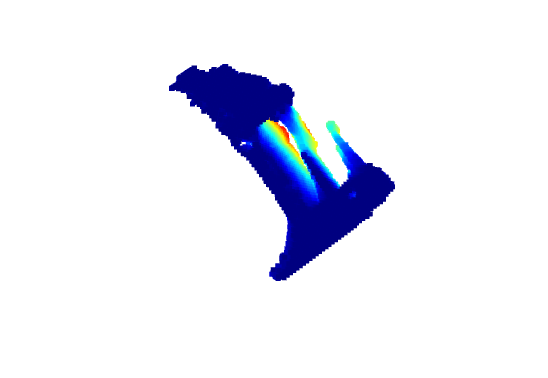
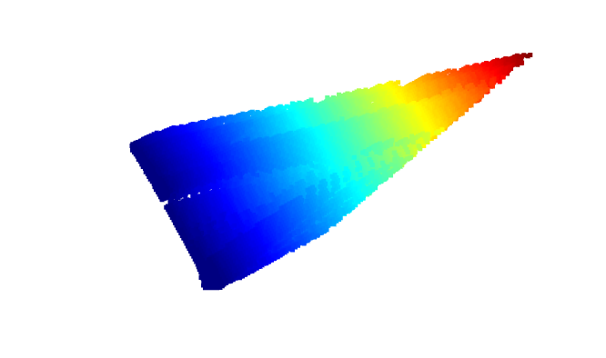
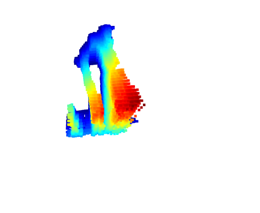
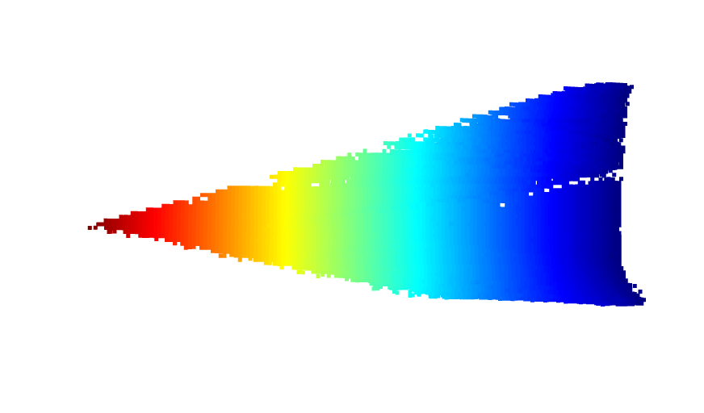
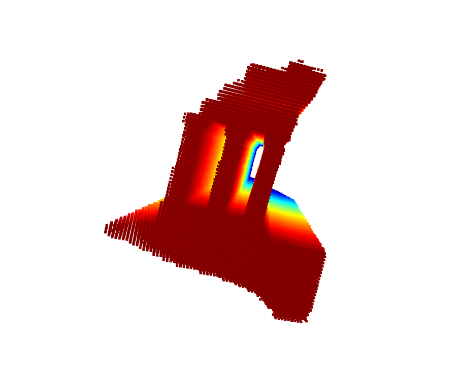

# Voxel Carving

For my starter project I tried to implement the voxel carving algorithm outlined in this paper. 
I used the temple dataset from the Middlebury Multi-View stereo data set. 

To build the camera matrices, I used the camera information provided in the data set. 
I had initially tried to build my own dataset using screenshots from Meshlab and the camera information 
that they allow access to. However, I wasn't able to parse the xml camera information that they provided
correctly and was ending up with wonky carvings. 

Switching over to the temple dataset made building the camera matrix easier. However, iterating 
over all the images causes the algorithm I wrote to carve all of the voxels. I'm not sure if this is a rounding
issue or something else because it seems to work correctly for any set of 1-10 images. 

I'm using open3D to render a point cloud of voxels that are left once my algorithm finishes iterating. 

## Results
Here are my results after iterating over 10 of the images in the dataset
It looks a little wonky and I would think it might be a rounding
error of some sort becuase the appearance of any one carving looks correct (figure 2).

## References
[Original Voxel Carving paper](https://www.cs.toronto.edu/~kyros/pubs/00.ijcv.carve.pdf)

[Image sillhouette extraction](http://creativemorphometrics.co.vu/blog/2014/08/05/automated-outlines-with-opencv-in-python)

[Camera matrix breakdown](http://ksimek.github.io/2012/08/14/decompose/) 